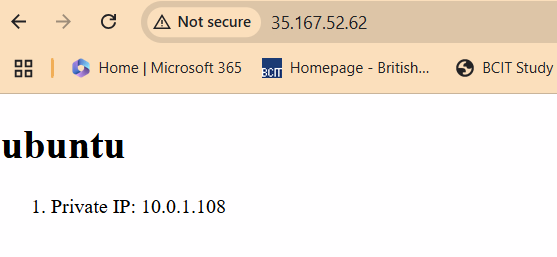

# 4640-w11-lab-start-w25

# EC2 Infrastructure Automation with Ansible

## Project Overview

This project automates the configuration of two AWS EC2 instances using Ansible:  
- A **frontend** server running **Ubuntu** with **Nginx**  
- A **backend** server running **Rocky Linux** with **Redis**

The configuration uses a dynamic inventory powered by AWS tags, role-based playbooks, and secure SSH authentication.

---

## Features and Setup

### 1. Role-Based Configuration

The main Ansible playbook (`play.yml`) dynamically applies roles based on instance tags:

- `redis_server` role runs on instances with the tag `server_role_redis_server`
- `frontend_servers` role runs on instances with the tag `server_role_frontend_server`

Dynamic SSH user assignment is handled like this:

```yaml
vars:
  ansible_user: "{{ 'rocky' if 'server_role_redis_server' in group_names else 'ubuntu' }}"
```

## Dynamic Inventory with AWS EC2 Plugin
The inventory is configured to automatically pull EC2 instance information using tags:

```yaml
keyed_groups:
  - key: tags.Role
    prefix: "server_role"
    separator: "_"

compose:
  ansible_host: public_dns_name
```

This means no hardcoded IPs or manual updates — inventory stays up-to-date with EC2.

##  Secure SSH Configuration

The SSH private key is specified in ansible.cfg:

```yaml
[defaults]
private_key_file = ~/.ssh/aws-4640-new.pem
host_key_checking = False
```

Manual SSH connectivity was tested using:

```yaml
ssh -i ~/.ssh/aws-4640-new.pem ubuntu@<public-ip>
ssh -i ~/.ssh/aws-4640-new.pem rocky@<public-ip>
```

## Testing and Troubleshooting

To verify inventory and configuration:

```yaml
ansible-inventory -i inventory/aws_ec2.yml --graph
ansible-inventory -i inventory/aws_ec2.yml --list | grep ansible_user
```

To run the playbook with verbose output:

```yaml
ansible-playbook -i inventory/aws_ec2.yml play.yml -vvv
```

## Frontend Web Page Screenshot

